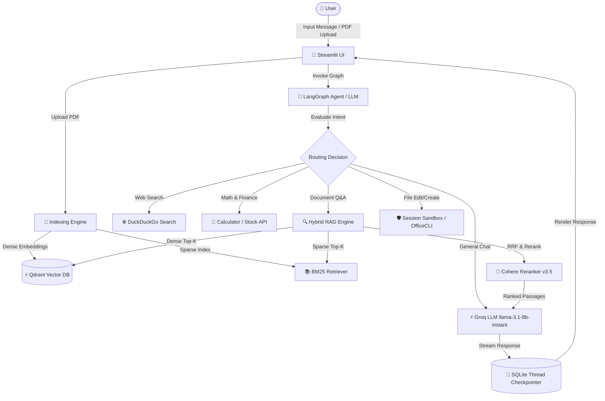

# 🚀 Nexora — Production Hybrid RAG & Multi-Tool Agentic Platform

[](https://www.python.org/)
[](https://github.com/langchain-ai/langgraph)
[](https://streamlit.io/)
[](https://qdrant.tech/)
[](LICENSE)

**Nexora** is an enterprise-ready, intelligent agentic chatbot platform built on **LangGraph**, **Qdrant**, and **Streamlit**. It seamlessly combines a **4-Stage Hybrid RAG Engine** with **Multi-Tool Reasoning**, persistent thread memory, and session-isolated file execution sandboxes.

---

## ✨ Key Features

- 🧠 **Intelligent Dynamic Routing**: Powered by a LangGraph state graph. Everyday chat & math execute directly; document queries trigger RAG; real-time web searches and financial queries auto-route to specialized tools.
- 🔍 **4-Stage Hybrid RAG Pipeline**:
  1. **Dense Retrieval**: Qdrant Vector Search (`Cohere embed-english-v3.0`).
  2. **Sparse Retrieval**: BM25 keyword matching via `rank-bm25`.
  3. **Reciprocal Rank Fusion (RRF)**: Merges dense and sparse score ranks.
  4. **Cohere Reranking**: Re-ranks top candidates using `rerank-v3.5` for high-precision context retrieval.
- ⚡ **Persistent Embedding Caching**: Automatic Qdrant collection hash check skips re-embedding uploaded documents if already indexed, dramatically cutting API cost and latency.
- 🛡️ **Session-Isolated Execution Sandbox**: Enables safe creation and modification of Office documents (`.docx`, `.xlsx`, `.pptx`) and plain-text files via `OfficeCLI` inside `/tmp/bot_sandboxes/` without touching the host workspace.
- 💾 **Stateful Thread Memory**: Persistent SQLite checkpointer (`chatbot.db`) preserves chat threads, allowing seamless conversation switching in the sidebar.
- 💻 **Modern Streamlit UI**: User-friendly sidebar for dynamic PDF uploading, thread history navigation, and active status streaming.

---

## 🏗️ Architecture Overview



---

## 📁 Repository Structure

```
Nexora/
├── src/nexora/                 # Core Nexora Python package
│   ├── __init__.py             # Package exports (version, chatbot, helpers)
│   ├── config.py               # Centralized configuration & environment loader
│   ├── core/                   # LangGraph Agent Core
│   │   ├── __init__.py
│   │   ├── agent.py            # StateGraph builder, nodes, conditional routing, compiled agent
│   │   ├── state.py            # TypedDict ChatState definition
│   │   ├── prompts.py          # Dynamic system prompt generator
│   │   └── database.py         # SQLite checkpointer & thread management helpers
│   ├── rag/                    # 4-Stage Hybrid RAG Engine
│   │   ├── __init__.py
│   │   ├── loader.py           # Document loading, path resolution, text chunking
│   │   └── retriever.py        # Qdrant dense + BM25 sparse + RRF + Cohere reranker
│   ├── tools/                  # Agent Tool Implementations
│   │   ├── __init__.py         # Tool registry & unified export
│   │   ├── calculator.py       # Arithmetic calculator tool
│   │   ├── search.py           # DuckDuckGo live web search tool
│   │   ├── finance.py          # Alpha Vantage financial stock price tool
│   │   ├── rag_tool.py         # Hybrid RAG document retrieval tool
│   │   └── sandbox_tool.py     # Session-isolated sandbox tool (OfficeCLI & text)
│   └── ui/                     # User Interface
│       ├── __init__.py
│       └── app.py              # Streamlit web application & sidebar chat interface
├── data/                       # Structured persistent data
│   ├── sample/                 # Sample documents (e.g. Atomic_Habit.pdf)
│   ├── uploads/                # User-uploaded PDFs for dynamic indexing
│   └── chatbot.db              # Persistent SQLite conversation thread memory
├── trash/                      # 🗑️ Archived non-essential items
│   ├── README.md               # Explanation of archived files
│   ├── experiments/            # Archived experimental prototypes & notebooks
│   └── legacy_root_files/      # Old flat monolithic files moved out of root
├── main.py                     # Primary CLI launcher (auto-detects .venv)
├── pyproject.toml              # Project configuration & package definitions
├── requirements.txt            # Production dependency specifications
├── .env.example                # Environment variable configuration template
└── .gitignore                  # Version control ignore definitions
```

---

## 🛠️ Quickstart & Setup Guide

### 1. Prerequisites

- Python `3.10+`
- Qdrant Vector Database running locally or remotely (default: `http://localhost:6333`)

*(Optionally start Qdrant via Docker)*:
```bash
docker run -p 6333:6333 qdrant/qdrant
```

### 2. Installation

Clone the repository and install dependencies:

```bash
git clone https://github.com/hjalondhara08/Nexora.git
cd Nexora

# Create & activate virtual environment
python -m venv .venv
source .venv/bin/activate   # On Windows: .venv\Scripts\activate

# Install package and dependencies
pip install -r requirements.txt
pip install -e .
```

### 3. Environment Configuration

Copy the template `.env.example` to `.env` and fill in your API keys:

```bash
cp .env.example .env
```

Edit `.env`:
```ini
GROQ_API_KEY=gsk_your_groq_key
COHERE_API_KEY=your_cohere_key
QDRANT_URL=http://localhost:6333
```

---

## 🚀 Running the Application

Launch the Streamlit web interface using `main.py`:

```bash
python main.py
```

Or launch Streamlit directly:
```bash
streamlit run src/nexora/ui/app.py
```

To test the core agent in CLI mode directly:
```bash
python src/nexora/core/agent.py
```

Open your browser at `http://localhost:8501`.

---

## 📊 How the Hybrid RAG Works

1. **Document Ingestion**: When a PDF is uploaded via the Streamlit UI, it is automatically chunked into overlapping text passages.
2. **Dual Indexing**:
   - Chunks are vectorized with `Cohere embed-english-v3.0` and stored in **Qdrant**.
   - Chunks are indexed in memory with **BM25**.
3. **Smart Cache Verification**: On file upload, Qdrant is queried for an existing collection matching the file's collection name. If found, re-indexing is bypassed.
4. **Reciprocal Rank Fusion**: Dense & Sparse search results are combined using RRF scoring:
   $$RRF\_Score(d) = \sum_{m \in M} \frac{1}{k + r_m(d)}$$
5. **Reranking**: The top candidate passages are passed to Cohere's `rerank-v3.5` endpoint to select the most contextually relevant passages before prompt injection.

---

## 🛡️ Sandbox & OfficeCLI Integration

Nexora includes a session-scoped sandbox tool (`sandbox_file_tool.py`) that interacts with **OfficeCLI**. When requested to create or edit documents:
- Operations execute inside isolated directories (`/tmp/bot_sandboxes/`).
- Prevents path-traversal attacks (`../`) and unintended workspace modifications.
- Supports generating Word (`.docx`), Excel (`.xlsx`), and PowerPoint (`.pptx`) presentations on the fly.

---

## 🤝 Contributing

Contributions are welcome! Please follow these steps:
1. Fork the project repository.
2. Create a feature branch (`git checkout -b feature/AmazingFeature`).
3. Commit your changes (`git commit -m 'Add AmazingFeature'`).
4. Push to the branch (`git push origin feature/AmazingFeature`).
5. Open a Pull Request.

---

## 📜 License

Distributed under the MIT License. See `LICENSE` for more details.
